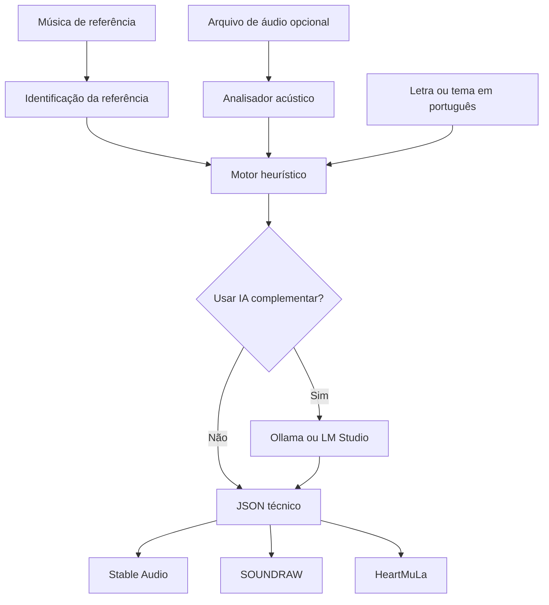
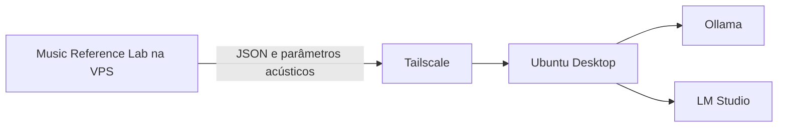

<div align="center">

# Music Reference Lab

**Análise acústica de referências musicais e exportação estruturada para ferramentas de geração de áudio com IA.**


</div>

## Visão geral

O **Music Reference Lab** recebe uma música de referência, uma letra ou tema e, opcionalmente, um arquivo de áudio. A aplicação mede características acústicas, organiza os resultados em JSON e prepara uma exportação específica para **Stable Audio**, **SOUNDRAW** ou **HeartMuLa**.

O projeto usa a faixa de referência como um mapa de características gerais, como andamento, tonalidade, atmosfera, instrumentação, densidade, dinâmica e estrutura. Ele não foi desenhado para reproduzir melodias, riffs, hooks, samples ou letras protegidas.

## Principais recursos

- referência por link do YouTube, YouTube Music ou Título + Artista;
- upload opcional de MP3, WAV, FLAC, M4A, OGG ou AAC;
- estimativa local de BPM;
- estimativa de tonalidade e escala;
- análise de dinâmica e brilho espectral;
- densidade rítmica e proporção percussiva;
- estimativa de largura estéreo;
- Schema A, compacto;
- Schema B, avançado;
- letra preservada em português;
- parâmetros técnicos estruturados em inglês;
- IA complementar opcional por análise;
- suporte a Ollama;
- suporte a LM Studio e endpoints compatíveis com OpenAI;
- exportação para Stable Audio;
- exportação para SOUNDRAW;
- exportação para HeartMuLa;
- download do resultado completo em JSON;
- interface responsiva para desktop e celular;
- execução com Docker Compose.

## Como funciona



## Schemas de análise

### Schema A, compacto

Focado nos parâmetros essenciais:

- genre;
- subgenre;
- BPM;
- key;
- scale;
- mood;
- main instruments;
- vocal profile;
- production tags.

### Schema B, avançado

Inclui o Schema A e acrescenta:

- estrutura por seções;
- curva de energia;
- perfil de bateria;
- perfil de baixo;
- harmonia;
- características vocais;
- reverb;
- compressão;
- stereo width;
- densidade de mix;
- perfil dinâmico;
- caráter de masterização;
- transições e tags de produção.

## IA complementar

A IA complementar é **opcional** e fica desligada por padrão em cada análise.

Na VPS, a configuração recomendada é:

```env
AI_PROVIDER=none
```

Nesse modo, a VPS executa a análise acústica e heurística sem carregar um LLM.

Quando houver um provedor configurado, a interface disponibiliza o seletor de IA complementar. A chamada ao modelo só ocorre quando o usuário ativa esse seletor para aquela análise.

### Arquitetura recomendada para laboratório doméstico



Isso permite manter a aplicação leve na VPS e usar o desktop Ubuntu para inferência quando ele estiver disponível.

> Não exponha Ollama ou LM Studio diretamente à Internet. Prefira uma rede privada, como Tailscale, e limite o serviço às interfaces necessárias.

Mais detalhes em [`docs/REMOTE_AI.md`](docs/REMOTE_AI.md).

## Plataformas de destino

| Destino | Exportação gerada | Uso principal no app |
|---|---|---|
| Stable Audio | prompt principal, negative prompt e duração | base e produção instrumental |
| SOUNDRAW | genre, mood, tempo, instrumentos, duração e curva de energia | construção modular de instrumental |
| HeartMuLa | style tags, título, estrutura e letra | composição orientada por letra e vocal |

O resultado apresenta também um atalho direto para a plataforma escolhida.

## Instalação com Docker

### Requisitos

- Docker Engine;
- Docker Compose Plugin;
- porta `8080` disponível.

Clone o repositório:

```bash
git clone git@github.com:EduMiranda78/music-reference-lab.git
cd music-reference-lab
```

Crie o arquivo de ambiente:

```bash
cp .env.example .env
```

Suba a aplicação:

```bash
docker compose up -d --build
```

Abra:

```text
http://localhost:8080
```

### Inicialização rápida

```bash
bash start.sh
```

Para uma máquina local comum, encerre o serviço com:

```bash
bash stop.sh
```

> Em servidores acessados por Tailscale SSH, a recriação de containers e bridges Docker pode interromper a sessão SSH em alguns ambientes. Faça operações de ciclo de vida do Docker por um acesso alternativo quando o servidor apresentar esse comportamento.

## Instalação sem Docker

Requisitos adicionais:

- Python 3.12;
- FFmpeg;
- libsndfile.

No Ubuntu:

```bash
sudo apt update
sudo apt install -y python3-venv ffmpeg libsndfile1
python3 -m venv .venv
source .venv/bin/activate
pip install --upgrade pip
pip install -r requirements.txt
cp .env.example .env
python app.py
```

A aplicação ficará disponível em:

```text
http://127.0.0.1:8080
```

## Configuração

Arquivo `.env` básico:

```env
FLASK_SECRET_KEY=troque-esta-chave
AI_PROVIDER=none
```

### Ollama

```env
AI_PROVIDER=ollama
OLLAMA_URL=http://100.x.y.z:11434
OLLAMA_MODEL=nome-do-modelo
```

### LM Studio ou endpoint compatível

```env
AI_PROVIDER=openai_compatible
OPENAI_COMPATIBLE_BASE_URL=http://100.x.y.z:1234/v1
OPENAI_COMPATIBLE_API_KEY=
OPENAI_COMPATIBLE_MODEL=nome-do-modelo
```

Nunca envie o arquivo `.env`, tokens ou credenciais ao GitHub.

## Estrutura do projeto

```text
music-reference-lab/
├── app.py
├── audio_analysis.py
├── ai_engine.py
├── heuristic_engine.py
├── exporters.py
├── reference_metadata.py
├── schemas.py
├── smoke_test.py
├── requirements.txt
├── Dockerfile
├── docker-compose.yml
├── start.sh
├── stop.sh
├── static/
│   └── style.css
├── templates/
│   ├── index.html
│   ├── result.html
│   └── error.html
├── docs/
│   ├── ARCHITECTURE.md
│   └── REMOTE_AI.md
└── .github/
    └── workflows/
        └── ci.yml
```

## Análise acústica

Quando um arquivo de áudio é enviado, o módulo `audio_analysis.py` utiliza Librosa e NumPy para extrair ou estimar:

| Medida | Finalidade |
|---|---|
| BPM | andamento aproximado |
| Key / Scale | centro tonal e modo estimados |
| RMS | intensidade média aproximada |
| Dynamic Range | variação de energia |
| Spectral Centroid | tendência de brilho do espectro |
| Onset Density | densidade de eventos rítmicos |
| Percussion Ratio | relação aproximada entre conteúdo harmônico e percussivo |
| Stereo Width | indicador aproximado de abertura estéreo |

Esses valores são estimativas. Devem ser tratados como referência técnica e validados de ouvido ou em uma DAW quando a precisão for crítica.

## Privacidade e segurança

- o link do YouTube é usado para identificação da referência;
- o aplicativo não baixa automaticamente áudio do YouTube;
- arquivos enviados são processados localmente pela aplicação;
- `.env` é excluído do contexto do Docker e do Git;
- uploads e exports não são versionados;
- a IA complementar pode permanecer completamente desativada;
- endpoints remotos de IA devem ficar em rede privada;
- o usuário deve processar somente áudio que tenha direito de utilizar.

Consulte [`SECURITY.md`](SECURITY.md) antes de expor o serviço publicamente.

## Testes

Teste rápido do núcleo heurístico e dos exportadores:

```bash
python smoke_test.py
```

Validação de sintaxe:

```bash
python -m compileall -q .
```

O repositório também inclui validação automática em GitHub Actions.

## Roadmap

- [ ] histórico persistente de análises;
- [ ] exclusão automática de uploads após processamento;
- [ ] detecção mais detalhada de seções musicais;
- [ ] comparação entre duas referências;
- [ ] presets de produção reutilizáveis;
- [ ] autenticação para exposição externa;
- [ ] WSGI de produção e proxy reverso documentados;
- [ ] status remoto de Ollama ou LM Studio na interface;
- [ ] exportação de presets por versão;
- [ ] testes automatizados adicionais.

## Documentação

- [Arquitetura](docs/ARCHITECTURE.md)
- [IA remota no Ubuntu Desktop](docs/REMOTE_AI.md)
- [Segurança](SECURITY.md)
- [Contribuição e manutenção](CONTRIBUTING.md)
- [Histórico de versões](CHANGELOG.md)

## Autor

Desenvolvido e mantido por **Eduardo Miranda**.

GitHub: [`EduMiranda78`](https://github.com/EduMiranda78)

## Licenciamento

Repositório privado. O código permanece sob os direitos autorais do autor e não deve ser redistribuído sem autorização.
