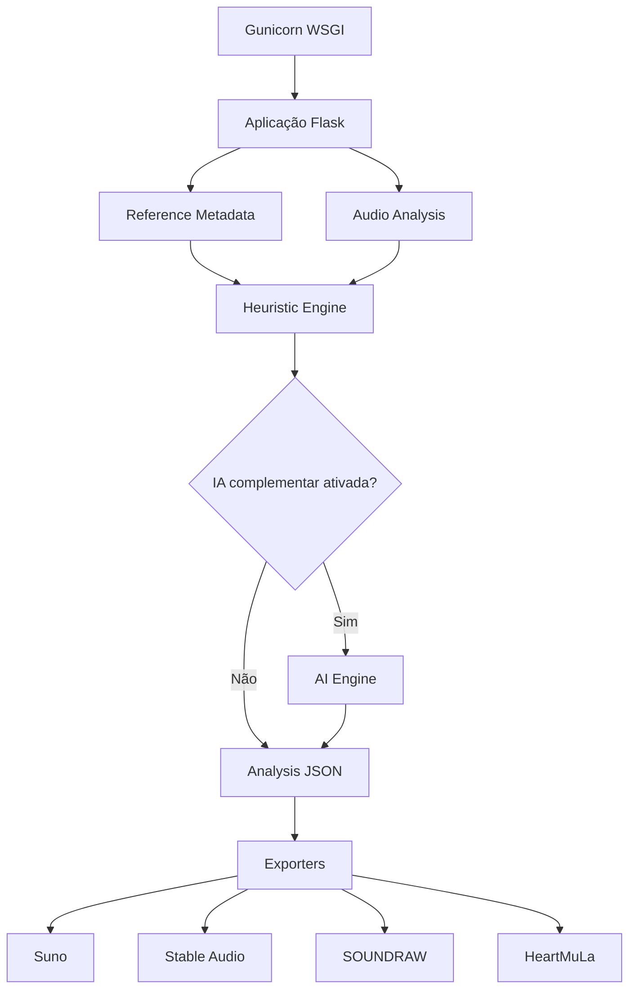

# Arquitetura

## Objetivo

O Music Reference Lab separa a análise musical em camadas para permitir execução leve na VPS e enriquecimento opcional em uma máquina com maior capacidade computacional.

## Fluxo principal



## Camada web de produção

A imagem Docker executa a aplicação com Gunicorn através de `wsgi:app`.

Configuração atual:

- 1 worker;
- 2 threads;
- timeout de 300 segundos;
- graceful timeout de 30 segundos;
- reciclagem do worker a cada até 200 requisições, com jitter;
- logs de acesso e erro enviados para stdout/stderr;
- healthcheck HTTP local em `127.0.0.1:8080`.

A escolha de 1 worker reduz consumo de memória na VPS. As 2 threads permitem atender pequenas requisições concorrentes sem duplicar todo o processo Python. O timeout ampliado considera análises de áudio e chamadas de IA remota que podem levar mais tempo.

O comando `python app.py` permanece apenas como opção de desenvolvimento local.

## Componentes

### `wsgi.py`

Entry point WSGI usado pelo Gunicorn.

### `app.py`

Responsável por:

- rotas Flask;
- validação básica do formulário;
- recebimento de áudio;
- orquestração da análise;
- seleção da IA complementar;
- seleção da plataforma de destino;
- geração e download do JSON final.

### `audio_analysis.py`

Camada de DSP baseada em Librosa e NumPy. Mede características acústicas que não dependem de um LLM.

### `reference_metadata.py`

Identifica links e consulta os metadados públicos disponíveis para referências do YouTube.

### `heuristic_engine.py`

Produz uma análise conservadora a partir dos dados disponíveis. Evita inventar precisão quando não há áudio ou IA complementar.

### `ai_engine.py`

Camada opcional de enriquecimento. Atualmente suporta:

- Ollama;
- endpoints compatíveis com OpenAI, incluindo LM Studio.

### `exporters.py`

Converte o JSON de análise em formulários específicos para cada plataforma de destino:

- Suno;
- Stable Audio;
- SOUNDRAW;
- HeartMuLa.

O exportador Suno prepara campos para o Custom Mode, incluindo Styles, Lyrics, Title, Exclude e sugestões iniciais para os sliders criativos.

### `schemas.py`

Define as estruturas compacta e avançada usadas como contrato da análise.

## Princípio de separação

O LLM não precisa receber o arquivo de áudio. O desenho atual permite que a VPS faça a extração acústica e envie somente metadados e JSON para o provedor remoto de IA.

Isso reduz consumo de banda, evita enviar áudio ao modelo e permite manter a VPS sem carga de inferência.

## Dados persistentes

Os diretórios abaixo são tratados como dados de runtime:

```text
uploads/
exports/
```

Eles não devem ser versionados no Git.

Em Docker, são montados como volumes para persistência fora do container.

## Limites atuais

- não existe banco de dados;
- não existe autenticação;
- os arquivos de upload ainda não possuem rotina automática de expurgo;
- gênero e arranjo ficam deliberadamente genéricos sem áudio ou IA complementar.
