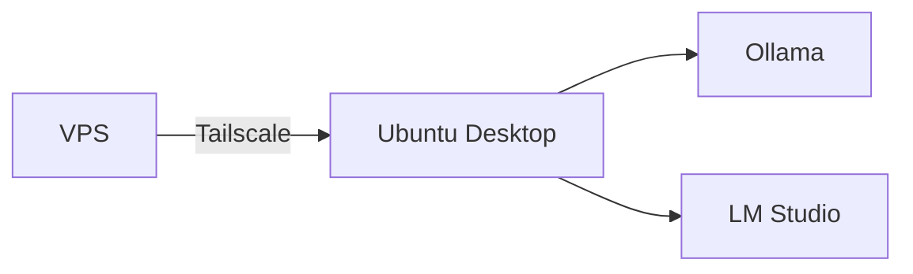

# IA remota no Ubuntu Desktop

## Cenário recomendado

A VPS executa o Music Reference Lab sem LLM. O desktop Ubuntu do laboratório executa Ollama ou LM Studio e fica acessível somente pela rede privada.



## Comportamento da interface

A IA complementar fica desligada por padrão.

Quando `AI_PROVIDER=none`, o aplicativo não tenta consultar nenhum modelo.

Quando um provedor está configurado, o seletor fica disponível e a chamada só é feita se o usuário optar por usar IA naquela análise.

## Opção 1, Ollama

Exemplo de configuração no `.env` da VPS:

```env
AI_PROVIDER=ollama
OLLAMA_URL=http://100.x.y.z:11434
OLLAMA_MODEL=nome-do-modelo
```

O endereço deve apontar para o IP Tailscale do desktop Ubuntu ou para outro endereço privado controlado pelo usuário.

## Opção 2, LM Studio

Exemplo:

```env
AI_PROVIDER=openai_compatible
OPENAI_COMPATIBLE_BASE_URL=http://100.x.y.z:1234/v1
OPENAI_COMPATIBLE_API_KEY=
OPENAI_COMPATIBLE_MODEL=nome-do-modelo
```

## Segurança

- não publique as portas `11434` ou `1234` diretamente na Internet;
- use Tailscale ou outra VPN privada;
- restrinja firewall e bind do servidor quando possível;
- não armazene chaves no GitHub;
- use `.env` somente no ambiente de execução;
- teste a conectividade privada antes de habilitar a IA no aplicativo.

## VPS offline em relação ao desktop

Se o desktop estiver desligado, mantenha a IA complementar desativada na interface. A análise acústica e heurística continua funcionando sem o modelo remoto.
